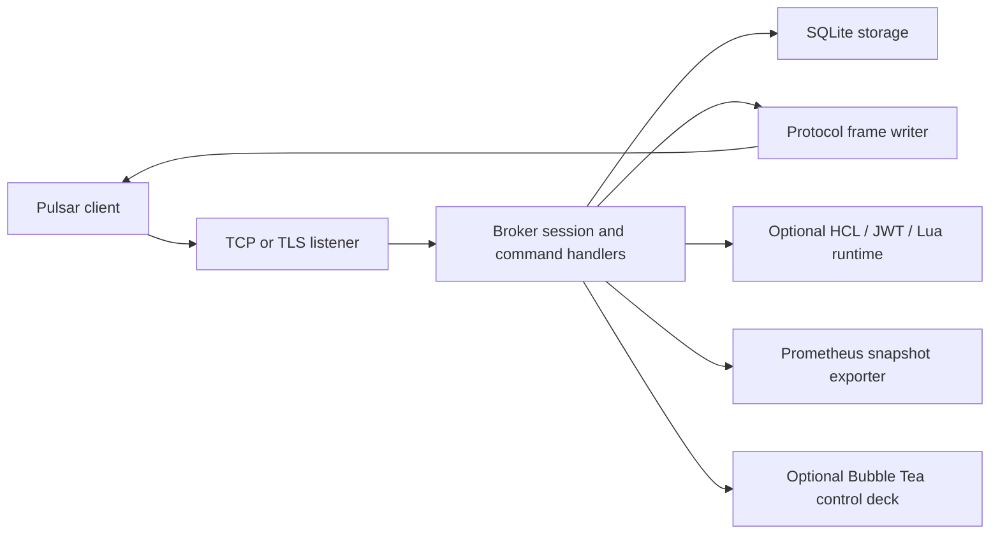
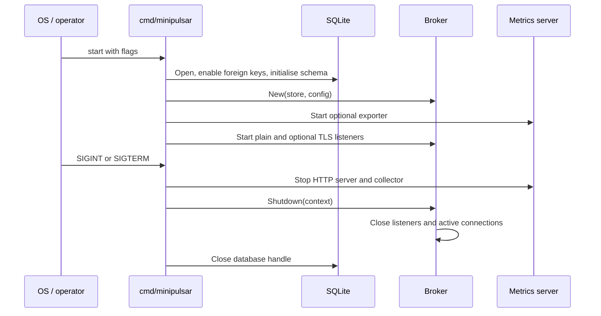

## Motivation and scope

Apache Pulsar normally couples protocol brokers, metadata services, BookKeeper,
and cluster coordination. minipulsar intentionally collapses that architecture
into a single Go process and SQLite database. The trade-off is explicit: it
provides a small operational footprint and familiar client protocol, not
horizontal scale or replicated durability.

## Runtime layers

- `cmd/minipulsar` assembles runtime dependencies from CLI flags.
- `internal/broker` owns connection state, command dispatch, subscriptions,
  delivery, and lifecycle.
- `internal/storage` owns durable topic, cursor, pending, and cleanup state.
- `internal/protocol` serializes Pulsar-compatible command and message frames.
- `internal/messaging` is optional policy and transformation control plane.
- `internal/metrics`, `internal/logging`, and `internal/tui` are operator-facing
  adapters and do not own messaging state.

## Startup and shutdown

The broker tracks listeners and active connections. Shutdown cancels background
maintenance, closes network resources, and waits for tracked worker activity up
to the caller's context deadline.

## Concurrency boundaries

- One goroutine reads commands for each client connection.
- Outbound frames are serialized with one mutex per connection so control frames
  and delivered messages never interleave.
- At most one persistent delivery loop runs for a `(topic, subscription)` state.
- SQLite transactions protect claim, cursor, pending, acknowledgement, reset,
  and redelivery changes.
- The TUI and Prometheus exporter consume snapshots; neither mutates durable
  data except through explicit broker throttle controls.
