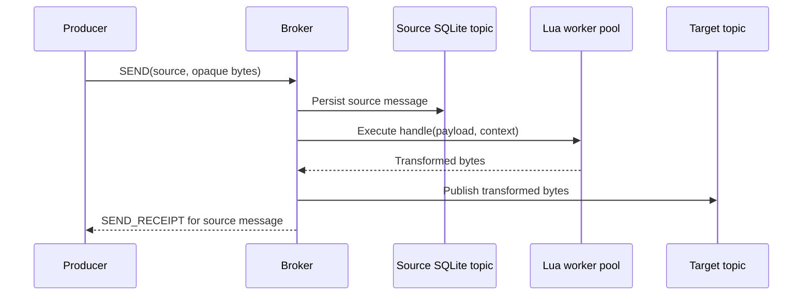

The messaging configuration is optional. It supplies three independent concerns:
namespace authorization/retention policy, named Lua functions, and bindings that
republish transformed bytes from a source topic to a target topic.

## Configuration shape

```hcl
security {
  mode = "strict"
}

namespace "persistent://public/default" {
  produce = ["writer"]
  consume = ["reader"]
  retention_seconds = 300
  subscription_timeout_seconds = 3600
}

function "transform" {
  path = "transform.lua"
  max_runtime = "250ms"
}

binding {
  source = "persistent://public/default/input"
  function = "transform"
  target = "persistent://public/default/output"
}
```

The Lua source must expose `handle(payload, ctx)`. Both payload and result are
bytes. A function binding is not an Apache Pulsar Functions deployment: it runs
in the minipulsar process, uses a bounded worker pool, and has no external state
or distributed checkpointing.

## Binding publish path



Bindings run synchronously after source publication and before the producer
receipt is written. A function failure is logged and does not roll back the
already persisted source message. Design transformations to be bounded, pure,
and idempotent. Target publishing does not recursively evaluate bindings in the
current implementation, but cyclic configurations are still difficult to reason
about and should be avoided.

## Namespace policy consequences

- `produce` and `consume` lists are role allowlists.
- `retention_seconds` controls cleanup age for consumed and orphaned messages.
- `subscription_timeout_seconds` removes subscriptions that have not been
  actively served for the configured duration.
- Produce/consume authorization applies to persistent and non-persistent topic
  namespaces. Retention and maintenance apply only to persistent storage.
