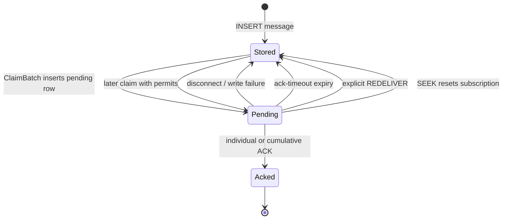

## The two durable delivery records

Persistent delivery is represented by two independent records per subscription:

- The **dispatch cursor** is the next entry ID that a claim should examine.
- The **pending set** is the durable ownership record for messages already
  claimed for a consumer but not acknowledged.

The cursor advances during `ClaimBatch`, not during ACK. This distinction makes
multiple consumers safe: a message can move past the cursor while remaining
pending, and another consumer's claim excludes it through the pending set.

`Stored` in the diagram means “eligible to be claimed”; it does not imply that
the cursor still points at the entry. Requeue operations lower the cursor to the
lowest affected entry, remove the matching pending rows, and make those entries
eligible again.

## Claim transaction

`Store.ClaimBatch` performs one SQLite transaction:

1. Resolve/create the topic row and verify the subscription still exists.
2. Update `last_consumer_at`.
3. Read `subscription_cursor.next_message_id`.
4. Select ordered message rows at or beyond that value that have no pending row
   for this subscription.
5. Insert a pending row for each selected entry with the server-side consumer
   UID and delivery timestamp.
6. Advance the cursor to one after the last examined entry.
7. Commit, then let the broker write message frames.

The transaction commits **before** network output. This intentionally favors no
concurrent duplicate claim over exactly-once socket delivery. A failed write,
consumer crash, or process interruption after commit can produce a replay.
Applications must make processing and acknowledgement idempotent.

## ACK ownership and subscription type

Individual ACK deletes only rows matching topic, subscription, message ID, and
the recipient's server-generated consumer UID. An ACK from another consumer is
a no-op. Cumulative ACK deletes that consumer's pending IDs up to the supplied
entry ID and is enabled only for Exclusive and Failover. Shared cumulative ACK
is ignored, because one consumer must never acknowledge another consumer's work.

The broker does not validate the ledger ID in ACK message IDs; all produced IDs
use ledger `0`. Do not send acknowledgements for a different logical ledger.

## Flow permits and scheduling

`FLOW` increments a consumer-local permit count. A persistent delivery loop
starts only when at least one consumer is eligible and permitted. Each loop
claims at most 200 messages, or fewer when the selected consumer has fewer
permits. It then writes the whole claimed batch to that selected consumer.

Consequences:

- Shared distribution is **batch-level** round robin, not strict one-message
  alternation.
- A slow socket holds its pending ownership until disconnect or timeout.
- Failover selects the numerically highest-priority consumer; if that consumer
  has no permits, it does not fall back to a lower-priority consumer.
- A wake-up only starts a loop when no loop is already marked active. A FLOW or
  publish arriving while an old loop is exiting may need another trigger before
  it is observed. Treat permit/publish activity as the normal trigger mechanism.

## Replay latency

Disconnect cleanup is immediate once the connection loop ends. Ack-timeout
replay occurs no earlier than `ack-timeout` and no later than approximately
`ack-timeout + ack-timeout-check-interval`, plus database and scheduling delay.
The check interval therefore belongs in latency and duplicate-delivery capacity
planning.
