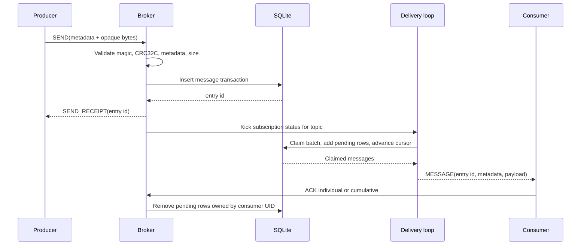
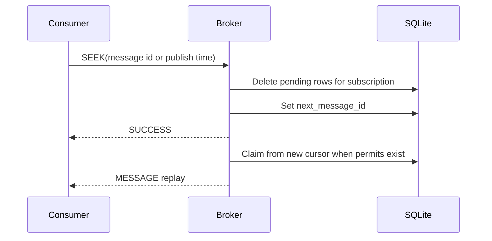

# Messaging semantics

## Persistent publish, delivery, and acknowledgement

Persistent delivery is at-least-once. A pending row is committed before socket
write. If a connection fails after the claim and before the consumer processes
the frame, the message is eligible for redelivery.

## Subscription types

| Type | Behaviour | Cumulative ACK |
|---|---|---|
| Exclusive | One attached consumer; another attachment is rejected. | Supported |
| Shared | Permitted consumers are selected round-robin. | Ignored to preserve correctness |
| Failover | Highest-priority permitted consumer receives messages. | Supported |
| Key_Shared | Not supported. | N/A |

## Start positions, seek, and redelivery

For a new persistent subscription:

- `initialPosition=Earliest` begins at the first stored entry.
- `initialPosition=Latest` begins after the newest stored entry.
- `start_message_id` selects an explicit entry ID on ledger `0`.
- `start_message_rollback_duration_sec` resolves the first message at or after
  the calculated timestamp when retained history exists.

`SEEK` resets the shared subscription cursor to a message ID or publish time and
clears outstanding pending rows. `REDELIVER_UNACKNOWLEDGED_MESSAGES` requeues
selected pending entries, or all entries owned by that consumer when no IDs are
provided. Either action can duplicate a frame already written to a consumer;
clients must keep acknowledgement handling idempotent.

## Timeouts and disconnects

On disconnect, the broker removes that consumer's pending rows and rewinds the
cursor to the lowest removed entry. When `-ack-timeout` is set, a monitor does
the same for expired pending entries. Remaining eligible consumers then restart
delivery when they hold permits.

## Producer access

The broker supports Shared, Exclusive, WaitForExclusive, and
ExclusiveWithFencing modes. Fencing unregisters earlier producers in the local
broker process. It is not distributed fencing across nodes.
