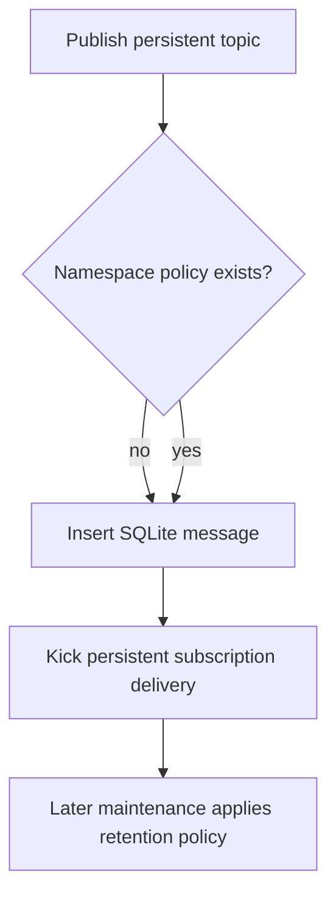

## Persistent publication is always durable first

Every publish to `persistent://...` inserts a SQLite row before the producer
receives its receipt. HCL retention policy controls **later deletion**, not
whether the receipt points at a durable entry. A persistent topic name therefore
always means the message entered the local durable log, subject to successful
SQLite commit.

With `retention_seconds = 0`, the next maintenance pass may delete consumed or
orphaned history quickly. Create a subscription before relying on long-lived
replay, or configure a positive retention period.

## Maintenance passes

Namespace maintenance runs at `-namespace-maintenance-interval` only when HCL
namespace policies exist. For each namespace it may:

1. Refresh active subscription timestamps from attached consumers.
2. Remove subscriptions inactive beyond `subscription_timeout_seconds`, including
   their cursors and pending entries.
3. Remove old consumed messages once all subscription cursors have moved beyond
   them and no pending record references them.
4. Remove old messages on topics without subscriptions.
5. Remove empty topics, except active producer/consumer topics and binding
   sources/targets.

Deletion is interval-driven, not synchronous with ACK. A zero retention period
uses the current maintenance timestamp as cutoff; it still waits for the next
maintenance pass.

## Time source caveat

`publish_time` is taken from incoming Pulsar metadata when nonzero. Retention
and timestamp-based seek compare that client-supplied value, not an authoritative
broker receive time. Clients with inaccurate clocks can make entries appear old,
future-dated, or invisible to a time seek. Producers that omit it receive the
broker's current milliseconds timestamp.

## Deletion consequences

Subscription timeout is destructive: after a stale subscription is removed, its
cursor and pending work are gone. If it was the final subscription on a topic,
orphan cleanup can subsequently delete retained messages. Treat subscription
timeouts as lifecycle cleanup, not temporary consumer failover.

The SQLite schema enforces foreign keys for newly used connections, but cleanup
also retains repair queries for legacy or manually altered databases. Do not edit
cursor or pending tables directly while the broker is running.
