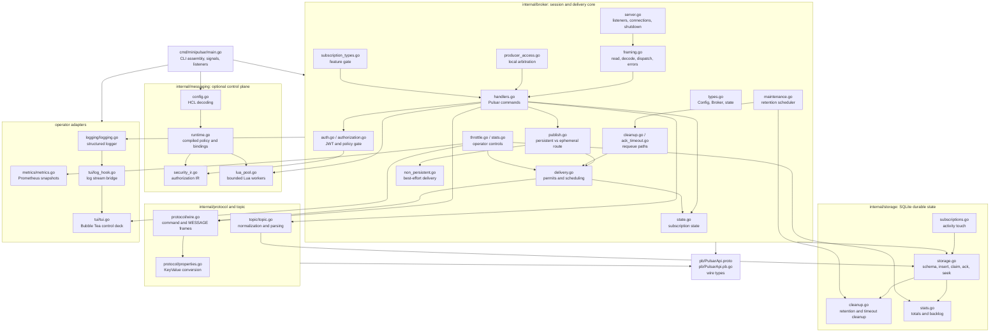

Use this page as the fastest entry point into the repository. Arrows show the
normal direction of dependency and runtime calls; they do not imply that every
file imports every other file in its cluster.

## Read a feature end to end

| Question | Start here | Follow next |
|---|---|---|
| Why did a client receive an error? | `broker/framing.go` | `broker/handlers.go`, `protocol/wire.go` |
| Where was this message persisted? | `broker/publish.go` | `storage/storage.go` |
| Why was a message replayed? | `broker/cleanup.go` or `ack_timeout.go` | `storage/storage.go`, `storage/cleanup.go` |
| Why is a consumer idle? | `broker/delivery.go` | `handlers.go` FLOW, `state.go` |
| Why was access denied? | `broker/authorization.go` | `broker/auth.go`, `messaging/security_ir.go` |
| Why is producer latency high? | `broker/handlers.go` SEND | `messaging/lua_pool.go`, `storage/storage.go` |
| Why does a dashboard number look wrong? | `broker/stats.go` | `storage/stats.go`, `metrics/metrics.go`, `tui/tui.go` |

## Test map

Every handwritten package has focused tests. `socket_integration_test.go` is the
cross-layer proof point for a real TCP session. Storage tests exercise actual
temporary SQLite files. Start with the matching `*_test.go` file before changing
an invariant, then add a socket test whenever a Pulsar client can observe the
new behavior.

For the exhaustive per-file explanation, continue to the
[Codebase reference](../codebase-reference/).
