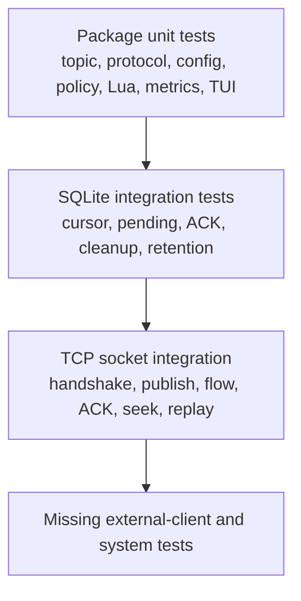

## Current test pyramid



Storage tests use temporary real SQLite files. They cover creation positions,
claim/cursor behavior, pending ownership, individual and cumulative ACK,
disconnect and timeout requeue, seek/reset helpers, retention, orphan repair,
and aggregate statistics. Protocol tests check emitted control/message frame
structure and CRC behavior.

Socket integration tests use TCP plus protobuf frames rather than mocks. They
cover CONNECT/PING, decoded unsupported-command errors, graceful shutdown,
producer-to-consumer delivery, FLOW, ACK, explicit start ID, last-message-ID,
redelivery, and SEEK.

## Mandatory checks

```bash
go test ./...
go test -race ./...
go vet ./...
git diff --check
```

## Important untested risks

- No official Go, Java, or Python Pulsar-client compatibility matrix.
- No TLS handshake/listener or JWT/policy socket integration test.
- No end-to-end producer access, resource-limit, ack-monitor, maintenance, or
  throttle test.
- No malformed-frame fuzz/property testing, SQLite lock/disk-full test, or
  crash/restart recovery test.
- No Lua worker saturation, timeout, shutdown, global-state isolation, or
  partial multi-binding failure test.
- No load benchmark or regression threshold for SQLite writer contention,
  pending-table growth, retention, or stats queries.

Treat these as a release gate for any claim beyond a single-node edge prototype.
