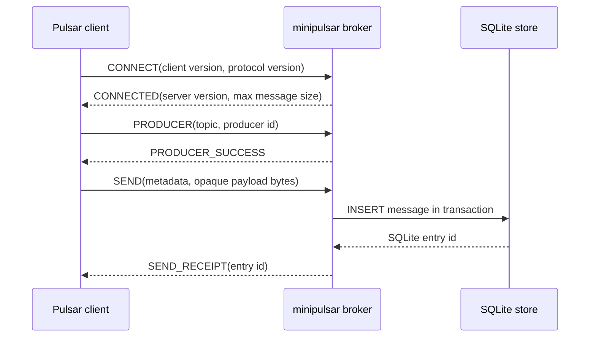
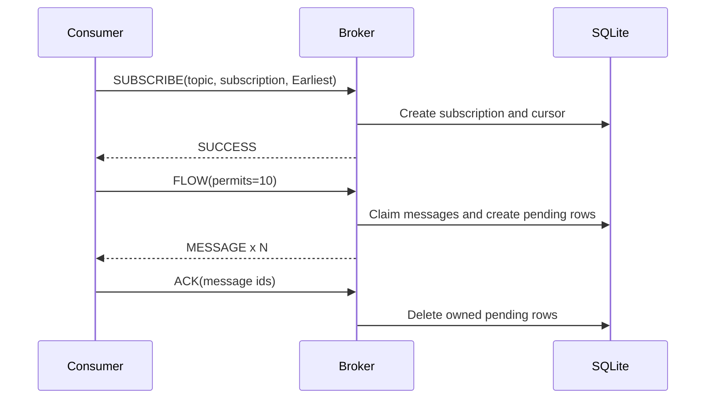

# Quick start

## Build and run

```bash
make build
./bin/minipulsar -addr :6650 -db ./minipulsar.db
```

The broker advertises `pulsar://localhost:6650` by default. Override the
advertised address with `-broker-url` when clients connect through a different
host name, container network, or load balancer.

## What happens on the wire



## First subscription

A consumer creates a durable subscription on a persistent topic, then grants
permits with `FLOW`. Delivery begins only when permits are available.



Use `Earliest` to consume retained history for a **new** subscription and
`Latest` to start after the newest current entry. An existing subscription keeps
its persisted cursor regardless of a later subscribe request.

## Persistent versus non-persistent

`persistent://tenant/namespace/topic` is stored in SQLite. A
`non-persistent://...` topic is delivered only to currently connected consumers;
there is no disk log, pending state, or replay after a disconnect.

## Next steps

- Configure limits, shutdown, and metrics in [Configuration and lifecycle](../../operations/configuration/).
- Learn delivery guarantees in [Messaging semantics](../../concepts/messaging-semantics/).
