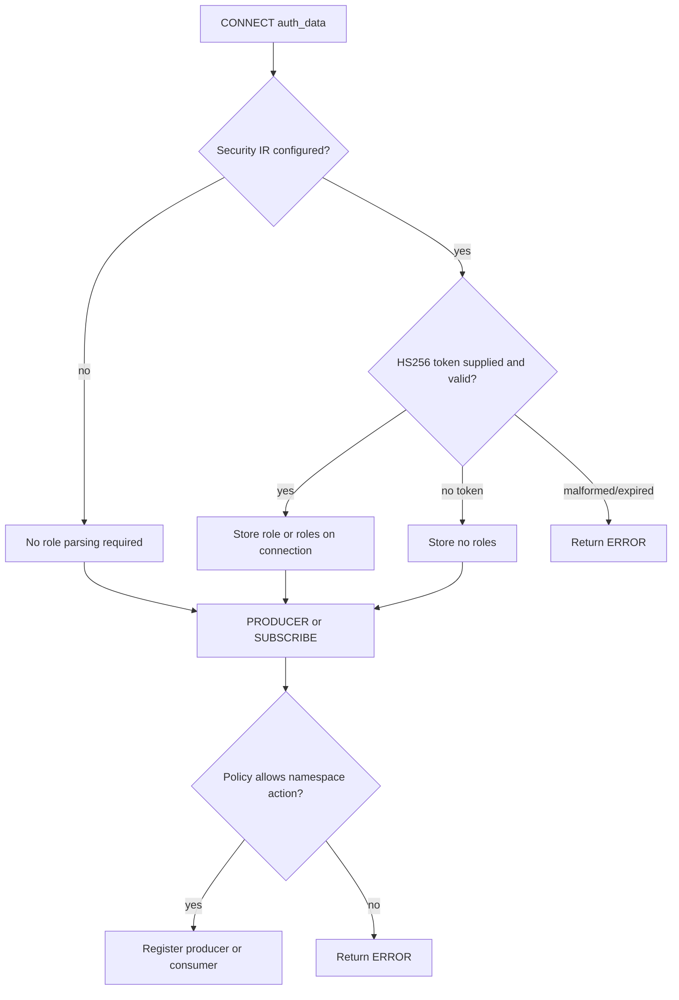

TLS, JWT parsing, and namespace authorization are independent optional layers.
TLS encrypts transport when enabled; JWT roles are evaluated only when the HCL
runtime contains a `security` block; authorization is checked when a producer or
consumer is created, not for every later SEND, FLOW, or ACK.

The JWT implementation accepts only HS256 and reads an optional `exp`, a single
`role`, or a `roles` string array. It does not verify issuer, audience,
not-before, key ID, token type, OAuth2 metadata, or asymmetric signing
algorithms. `Bearer ` prefixes are accepted but the Pulsar auth method field is
not used to select an authentication provider.

Missing auth data is accepted by CONNECT and results in no roles. In strict
mode, a later producer/consumer creation is denied unless an allowlist permits
that empty role set. In open mode, all actions are allowed; configuring a JWT
secret while using open mode does not protect topic access.

Roles are cached per TCP connection and cleared during connection cleanup. A
token expiration after CONNECT is not revalidated on later commands. Rotate the
shared secret through a controlled connection-restart procedure, not by assuming
live sessions will refresh automatically.
