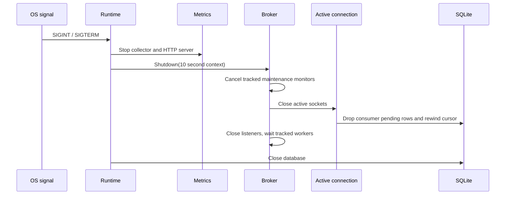

## Listener, deadline, and shutdown model

Plain and TLS listeners can run together. TLS requires both PEM files and TLS
1.2+, but has no client certificate authentication or certificate reload.
`-broker-url` values are lookup advertisements only: they must be configured to
the actual externally reachable scheme, host, and port.

Each read applies a new read deadline before receiving an outer frame; each
outbound command/message applies a write deadline. A peer that sends only part
of a valid frame occupies its connection until read timeout. The frame reader is
sequential, so a `WaitForExclusive` producer request can block subsequent
commands on its connection indefinitely.

Delivery loops are not individually lifecycle-tracked. Socket closure normally
causes their writes to fail and ends them, but do not rely on a shutdown to flush
all queued delivery work. A paused or delayed throttle can also postpone publish
and delivery progress: pause checks every 100 ms and delay levels add up to five
seconds per affected operation.

## Failure classification

| Condition | Broker effect | Client action |
|---|---|---|
| Bad outer/command length or protobuf | Close connection | Reconnect; do not reuse stream. |
| Bad SEND magic/CRC/metadata/payload limit | `SEND_ERROR` | Correct/retry according to application policy. |
| Unknown decoded command | `ERROR` with unsupported-version code | Feature-detect or avoid command. |
| Authorization/resource/producer failure | `ERROR` or `SEND_ERROR` | Inspect error; avoid blind retry loops. |
| Consumer write failure | Keep pending; cleanup/timeout requeues | Expect at-least-once replay. |
| SQLite error or busy timeout | Request error/log warning | Retry with bounded backoff; investigate storage. |

Metrics listener failures are logged by its own goroutine after startup. Monitor
the endpoint explicitly; a successful broker start does not prove metrics is
reachable.
