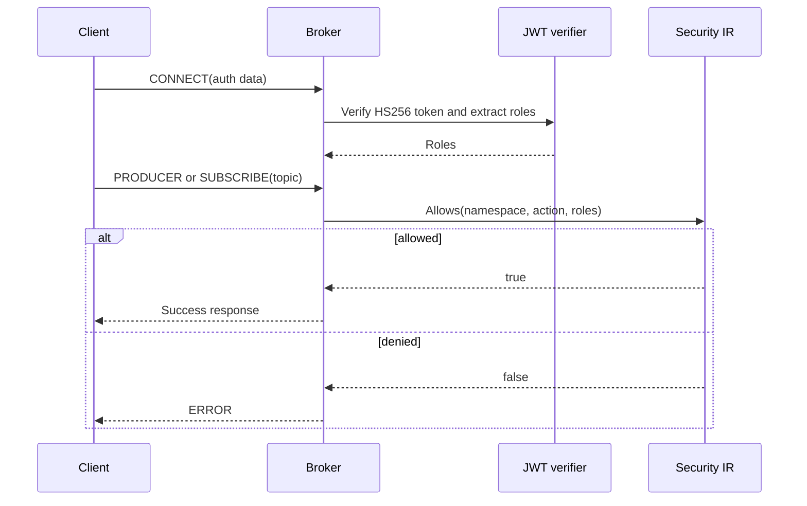

TLS and authentication are optional deployment modes. A local trusted network
can run plaintext without an HCL messaging configuration; when a policy is
configured, authorization is evaluated for producer creation and subscription.

For token claim scope, role caching, strict/open behavior, and enforcement
timing, read [Authentication and authorization boundary](../authentication-authorization/).

## TLS

Provide both `-tls-cert` and `-tls-key` to enable the TLS listener. The broker
requires TLS 1.2 or newer. Configure `-broker-url-tls` to the externally
reachable `pulsar+ssl://` URL. TLS does not imply client-certificate
authentication.

## JWT

The built-in verifier accepts HS256 bearer tokens supplied in `CONNECT` auth
data. It validates the signature and optional `exp` claim, then reads either a
single `role` string or `roles` array. Set the secret with `-jwt-secret` or
`MINIPULSAR_JWT_SECRET`.

## HCL policy flow

`strict` mode denies namespaces or actions without an explicit allowlist;
`open` mode allows them. The policy controls broker authorization only. It does
not encrypt payload bytes or implement schema validation.
