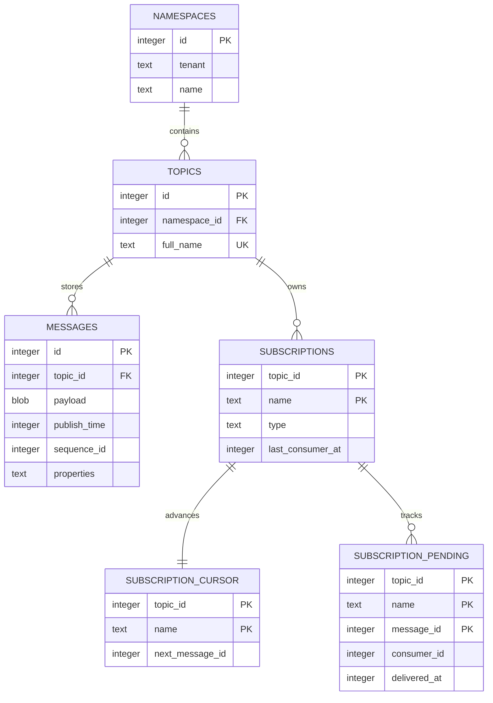

# SQLite storage model

## Tables and invariants

`subscription_cursor.next_message_id` is a **dispatch** cursor. It moves when a
claim succeeds, not when an acknowledgement arrives. `subscription_pending`
records claimed-but-unacknowledged deliveries and prevents duplicate concurrent
claims. Reset, disconnect, explicit redelivery, and timeout expiry remove pending
records and rewind the cursor to the lowest requeued entry.

`messages.id` is the persistent entry ID exposed to Pulsar clients on ledger
`0`. The payload column contains exactly the application bytes after Pulsar
metadata framing; schema inspection is intentionally absent.

## Query performance

The schema indexes `(topic_id, id)` for ordered delivery,
`(topic_id, publish_time)` for time positioning/retention, pending subscription
keys, and pending delivery time. SQLite WAL improves read concurrency but still
has a single writer. Size persistent deployments around write throughput, durable
message volume, and maintenance windows.
