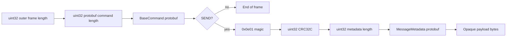

## Inbound frame shape

Every inbound command has a four-byte big-endian outer length followed by a
frame whose first four bytes are the protobuf command length. `SEND` leaves the
remaining bytes as a Pulsar message section.

The outer length must be nonzero and at most `-max-frame`; the command length
must be nonzero and fit inside that frame. Failure before a command is decoded
closes the connection because stream alignment cannot be trusted. A decoded
command rejected by business logic receives `ERROR`; a rejected `SEND` receives
`SEND_ERROR` with producer and sequence IDs.

## SEND integrity checks

The broker requires magic `0x0e01`, a nonempty metadata protobuf, and CRC32C
over `metadata-length || metadata || payload`. `-max-message` limits payload
bytes only. Metadata is therefore bounded by `-max-frame`, not by
`-max-message`.

The broker reads the entire accepted frame and payload into memory. Set both
limits conservatively for untrusted networks and size connection limits for the
worst case of concurrent max-sized frames.

## What survives a durable replay

SQLite stores payload bytes, sequence ID, publish time, and string properties.
When a message is replayed, minipulsar reconstructs metadata with producer name
`minipulsar` and ledger `0`/SQLite entry ID. The following are not retained,
decoded, or reproduced: original producer name, batch structure, compression,
chunking, schema/version, ordering key, event time, encryption fields, and
transaction metadata.

Sequence IDs are stored for metadata fidelity only. They are **not** a
deduplication key, so a producer retry can create another durable entry.
